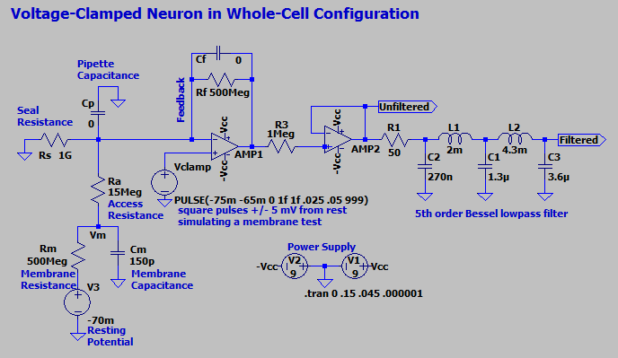

# The Patch-Clamp Membrane Test

This repository is a personal collection of notes and resources related to membrane tests (analytical methods performed on electrical traces to calculate membrane parameters of cells). It is currently being developed as part of a multi-part blog post on www.swharden.com

## Single Electrode Whole-Cell Voltage Clamp Circuit

**I created this model to simulate a patch-clamped neuron in whole-cell configuration.** Square voltage-clamp pulses mimic a membrane test protocol. By analyzing the clamp current trace alone I can derive values for Ra (access resistance), Rm (membrane resistance), and Cm (cell capacitance).

## Two Electrode Voltage Clamp Circuit

**I created this model to simulate a giant squid axon studied with a two-electrode system.** It's not particularly useful other than as a thought exercise. By clamping between two different voltages you can measure the difference in current passing through the stimulation resistor to estimate the neuron's membrane resistance.

