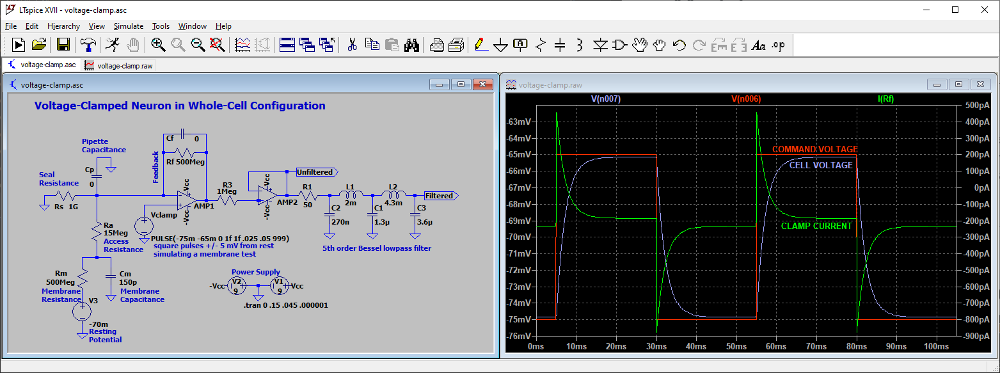

# The Patch-Clamp Membrane Test

This repository is a personal collection of notes and resources related to membrane tests (analytical methods performed on electrical traces to calculate membrane parameters of cells). It is currently being developed as part of a multi-part blog post on www.swharden.com

