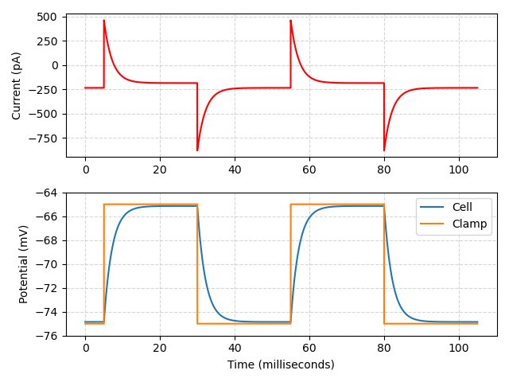
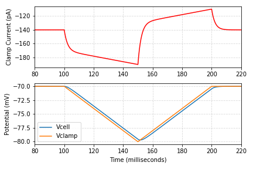
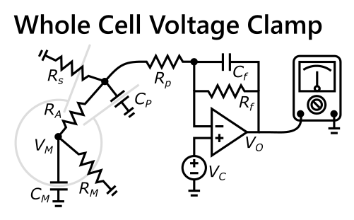
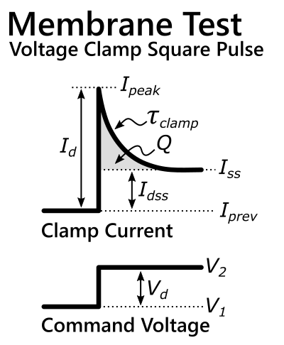
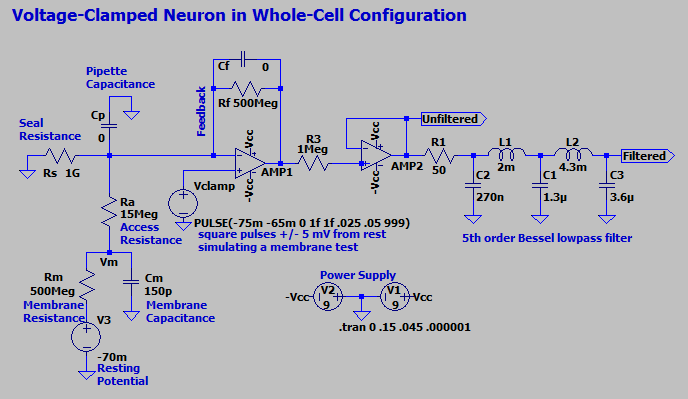
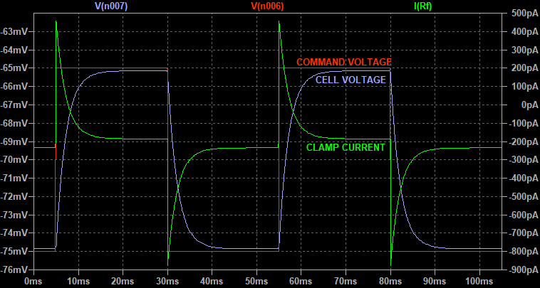
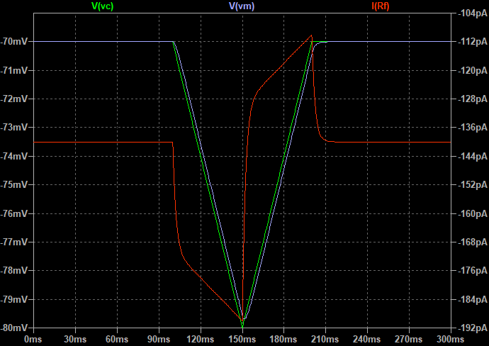
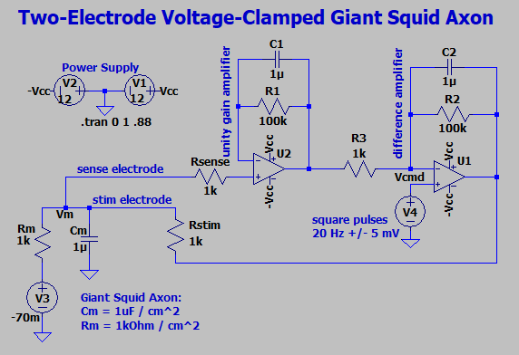
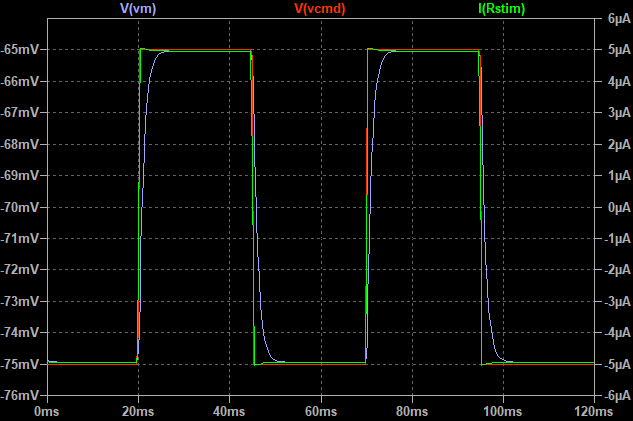

# The Patch-Clamp Membrane Test

This repository is a personal collection of notes and resources related to membrane tests.

## Articles

* [**Exploring the Membrane Test with a Voltage-Clamped Neuron Model**](https://swharden.com/blog/2020-10-11-model-neuron-ltspice/) **👈 This article describes the theory behind membrane test simulation and calculation** and has extensive notes about modeling patch-clamp systems with LTSpice. It also has an excellent list of resources including links to primary research papers about membrane tests.

## Code

* [**Membrane Test Step**](memtest/memtest-step.ipynb) - A Jupyter notebook demonstrating how to calculate Ra, Cm, and Rm from a simulated sweep of a voltage-clamp step protocol. It also demonstrates how to analyze LTSpice simulation data in Python.

* [**Membrane Test Ramp**](memtest/memtest-ramp.ipynb) - A Jupyter notebook demonstrating how to calculate Cm from a V-shaped voltage clamp ramp.

## Graphics

## Single Electrode Voltage-Clamp Model

## Two Electrode Voltage-Clamp Model

